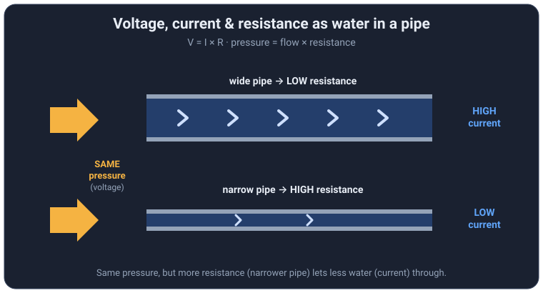
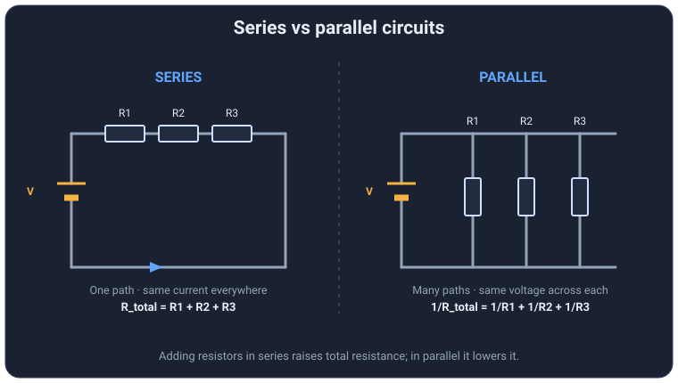
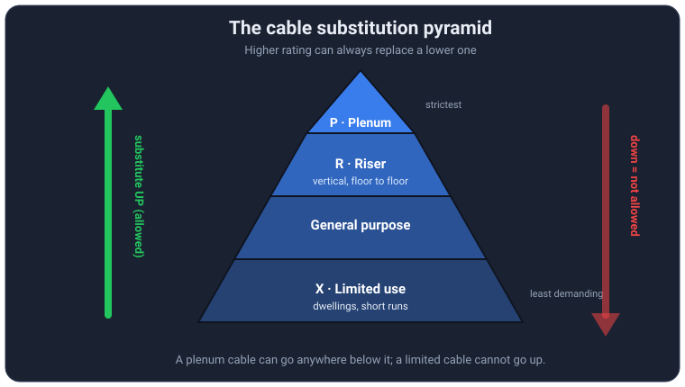

# CR-67 Low Voltage: The Plain-English Study Guide

A friendly, from-scratch introduction to every foundational idea the CR-67 Low
Voltage Communications Systems exam leans on. No experience assumed. If you can
read a ruler and do a little arithmetic, you can learn this.

This guide was built by reading all 160 questions in the practice bank and
pulling out the concepts they keep testing. It does not just list facts; it
explains *why* each fact is true so the answers stick and so you can reason
through a question you have never seen before. Codes change, so always confirm
against the current NEC/NFPA before doing real work.

**How to use it:** read a section, then go do those questions in the quiz app.
The concepts stick a lot faster when you immediately practice them. When a number
feels arbitrary, come back here and reread the "why" next to it.

---

## What is on the test (topic breakdown)

Here is roughly how the 160 practice questions split across topics. Two areas,
**fire alarm** and **cable types**, together make up almost 60% of everything, so
if you are short on time, master those first.

```
Fire alarm & detection (NFPA 72)  ████████████████   31%
Cable types, ratings & wire       ██████████████     28%
Grounding & bonding               ███████            13%
Separation, clearance & support   █████              10%
Electrical theory & measurement   █████              10%
Audio, video & telecom            ███                 6%
Codes, definitions & general      █                   2%
```

| Topic | Share | Where to study it |
|-------|-------|-------------------|
| Fire alarm & detection (NFPA 72) | ~31% | section 15 |
| Cable types, ratings & wire | ~28% | sections 9, 10, 11, 12 |
| Grounding & bonding | ~13% | section 13 |
| Separation, clearance & support | ~10% | section 16 |
| Electrical theory & measurement | ~10% | sections 1 to 8, and 18 |
| Audio, video & telecom | ~6% | section 17 |
| Codes, definitions & general | ~2% | section 14 |

A note on these numbers: they are counted from *this 160-question practice bank*
by assigning each question to its single best-fit topic, so they show where this
bank puts its weight. Treat them as a study-priority guide, not the official exam
blueprint, which the licensing body publishes separately. The takeaway holds
either way: fire alarm rules and cable ratings dominate, so spend your time there.

---

## Table of contents

1. [Electricity in sixty seconds](#1-electricity-in-sixty-seconds)
2. [Ohm's Law (the one formula to rule them all)](#2-ohms-law)
3. [Power, watts, and the pie wheel](#3-power-watts-and-the-pie-wheel)
4. [Series vs parallel circuits](#4-series-vs-parallel-circuits)
5. [Voltage drop (why the switch only saw 1.2 volts)](#5-voltage-drop)
6. [AC, DC, and sine waves](#6-ac-dc-and-sine-waves)
7. [Reading an oscilloscope](#7-reading-an-oscilloscope)
8. [Measuring instruments](#8-measuring-instruments)
9. [Wire gauge (AWG)](#9-wire-gauge-awg)
10. [Conductor insulation letter codes](#10-conductor-insulation-letter-codes)
11. [The low-voltage cable naming system](#11-the-low-voltage-cable-naming-system)
12. [Plenum, riser, and shaft](#12-plenum-riser-and-shaft)
13. [Grounding and bonding](#13-grounding-and-bonding)
14. [The codes: NEC and NFPA 72](#14-the-codes)
15. [Fire alarm essentials](#15-fire-alarm-essentials)
16. [Separation and clearance numbers](#16-separation-and-clearance-numbers)
17. [Audio, video, and telecom grab bag](#17-audio-video-and-telecom-grab-bag)
18. [Switches: poles and throws](#18-switches-poles-and-throws)
19. [Cheat sheet: formulas, numbers, and units](#19-cheat-sheet)

---

## 1. Electricity in sixty seconds

Electricity is just **electrons drifting through a conductor**. A conductor is a
material (copper, aluminum) whose outer electrons are loosely held, so a push can
nudge them along from atom to atom. That collective nudge, repeated down the
whole length of a wire, is an electric current. An insulator (the plastic jacket
on the wire) holds its electrons tightly, so current cannot flow through it, and
that is exactly why we wrap conductors in it.

Three quantities describe almost everything on this exam, and the easiest way to
keep them straight is the **water-in-a-pipe** analogy. Imagine water flowing
through plumbing:

- **Voltage (volts, V)** is the *pressure* pushing the water. No pressure, no
  flow. Voltage is not the electricity itself; it is the potential difference,
  the "want" to move, between two points. A 12 volt battery maintains 12 volts of
  pressure between its two terminals whether or not anything is connected.
- **Current (amperes, amps, A)** is the *rate of flow*, how much water actually
  moves past a point each second. In electricity it is the number of electrons
  per second. Nothing flows until the pressure has a complete loop to push
  through, which is why a circuit must be a closed path.
- **Resistance (ohms, Ω)** is the *pushback*, the friction that opposes flow. A
  long, thin, or clogged pipe resists more than a short, fat, clean one. In a
  wire, resistance comes from the electrons bumping into the atoms of the metal,
  which is also why resistance turns electrical energy into heat.

Hold this picture in your head:

> More pressure (voltage) pushes more water (current). A narrower or longer pipe
> (more resistance) lets less water through for the same pressure.



That one sentence is Ohm's Law stated in plain words, and roughly a fifth of the
exam is really just this picture wearing different costumes. Everything in the
next few sections is built on it.

One more idea that ties them together: **a circuit must be a complete loop.**
Current leaves the source, travels through the load, and returns. Break the loop
anywhere (a switch, a cut wire, a bad connection) and current stops everywhere in
that loop. That is why a single failure can kill an entire run, and it is the
heart of the troubleshooting questions later.

---

## 2. Ohm's Law

Ohm's Law is the mathematical version of the water-pipe sentence. It is the most
important equation on the exam because so many other ideas fall out of it:

```
V = I × R
```

Here **V** is volts, **I** is current in amps, and **R** is resistance in ohms.
Engineers write current as "I" (from the French *intensité de courant*), which
looks odd at first but is universal, so get comfortable with it.

Read the equation as a story: the voltage you measure across something equals how
much current is flowing times how hard that something resists. If either the
current or the resistance goes up, the voltage across that element goes up too.

You will need all three arrangements depending on what the question gives you:

| You know | You want | Formula |
|----------|----------|---------|
| current and resistance | voltage | V = I × R |
| voltage and resistance | current | I = V ÷ R |
| voltage and current | resistance | R = V ÷ I |

**The VIR triangle** is the fastest way to recall which is which without
memorizing three formulas. Draw V on top, with I and R side by side underneath:

```
      ( V )
     ( I | R )
```

Cover the quantity you want with a finger and read what is left. Cover **V** and
you see **I next to R**, meaning multiply: `V = I × R`. Cover **I** and you see
**V over R**, meaning divide: `I = V ÷ R`. Cover **R** and you get `R = V ÷ I`.
The triangle works because the layout literally encodes the algebra: things side
by side multiply, things stacked divide.

A quick intuition check you can apply to any answer: if you raise the resistance
but keep the voltage fixed, current must *fall* (I = V/R, bigger bottom means
smaller result). If your arithmetic ever says otherwise, you flipped the formula.

---

## 3. Power, watts, and the pie wheel

Voltage and current describe the push and the flow. **Power** describes the
actual *work* being done: heat in a resistor, light from a lamp, sound from a
speaker, motion in a motor. Power is measured in **watts (W)**, and its base
formula is simple:

```
P = V × I      (watts = volts × amps)
```

Why does multiplying pressure by flow give work? Because power is energy per
second, and moving more charge (current) across a bigger pressure difference
(voltage) does proportionally more work each second. A trickle at high pressure
and a flood at low pressure can deliver the same power.

**Worked example from the bank:** a 12 volt system draws 0.25 amps. Power is
`12 × 0.25 = 3 watts`. Notice how small the current is and how modest the power
is; that is the whole point of "low voltage" work.

Because `V = I × R`, you can substitute and get two more forms without memorizing
them as separate facts:

- `P = I² × R` (substitute V = IR into P = VI). Useful when you know current and
  resistance. Note the current is *squared*, so doubling current quadruples the
  heat. This is why undersized wire overheats: a little extra current makes a lot
  more heat.
- `P = V² ÷ R` (substitute I = V/R). Useful when you know voltage and resistance.

You only truly need to memorize two equations, `V = I × R` and `P = V × I`.
Everything else is those two rearranged. If charts help you, the **Ohm's Law /
Watt's Law pie wheel** arranges all four quantities (V, I, R, P) in a circle so
that knowing any two gives you the other two at a glance. Keep one nearby while
you practice, and after a dozen problems you will not need it.

---

## 4. Series vs parallel circuits

How components are connected decides how their resistances combine, and this is
one of the most tested calculation skills on the exam. There are two basic
arrangements, and it pays to recognize each on sight.



### Series: one single path

In a series circuit the components sit in a line, one after another, like beads
on a string. There is exactly one path for current.

- **Current is the same everywhere.** With only one path, every electron that
  passes through the first component must pass through all the rest. There is
  nowhere else to go.
- **Voltages add up.** Each component takes a share of the source voltage, and
  the shares must total the source. The volts have to go somewhere.
- **Resistances add up.** `R_total = R1 + R2 + R3 ...` More components in a row
  means more total friction, so total resistance climbs and current falls.
- **One break stops everything.** Because there is a single path, an open switch
  or broken wire anywhere kills the whole circuit. Old holiday light strings are
  the classic example: one dead bulb and the whole strand goes out.

### Parallel: multiple paths

In a parallel circuit the components bridge the same two points, like the rungs
of a ladder. Current has several routes.

- **Voltage is the same across every branch.** Each branch connects the same two
  nodes, so each sees the full source voltage.
- **Currents add up.** The source current splits among the branches and rejoins
  after, so the branch currents sum to the total.
- **Resistance goes DOWN, and this surprises people.** Adding another branch
  gives current one more path to take, which is like opening another checkout
  lane: more lanes, less total congestion. The formula is
  `1 / R_total = 1/R1 + 1/R2 + 1/R3 ...` For exactly two resistors there is the
  "product over sum" shortcut: `R_total = (R1 × R2) ÷ (R1 + R2)`.

**The single most useful sanity check on the whole exam:** total parallel
resistance is always *smaller than the smallest individual resistor*. If you
compute a parallel total that is bigger than one of the branches, you made an
error. A circuit whose branches look like ladder rungs is parallel; a straight
line of components is series.

### Worked example (the diagram question, mixed circuit)

A 10 volt source feeds a network. One branch has a 1, a 6, and a 3 ohm resistor
in series, so add them: `1 + 6 + 3 = 10 ohms`. That combined 10 ohm branch sits
in parallel with another 10 ohm resistor, so use product over sum:
`(10 × 10) ÷ (10 + 10) = 100 ÷ 20 = 5 ohms`. That 5 ohm equivalent is then in
series with a 2 and a 3 ohm resistor, so add again: `2 + 5 + 3 = 10 ohms total`.
The trick is to collapse the circuit in stages, replacing each series or parallel
cluster with its single equivalent value, until one number remains.

### Worked example (all parallel)

Three resistors, 20, 30, and 40 ohms, all in parallel across a 120 volt line.
Add the reciprocals: `1/20 + 1/30 + 1/40 = 0.0500 + 0.0333 + 0.0250 = 0.1083`.
Then invert: `R_total = 1 ÷ 0.1083 ≈ 9.2 ohms`. Sure enough, 9.2 is smaller than
20, the smallest branch, so the answer passes the sanity check.

---

## 5. Voltage drop

Voltage drop is one specific consequence of Ohm's Law, and it powers most of the
troubleshooting questions, so it earns its own section. The idea: whenever current
flows through any resistance, some voltage is "used up" across that resistance,
and the amount is `V = I × R`. Add up every drop around a series loop and the
total exactly equals the source voltage. This is Kirchhoff's voltage law, but you
can simply think, "the volts have to land somewhere, and they land in proportion
to resistance."

In a healthy circuit, voltage drops occur where you want them, mainly across the
load that is doing the work. A problem shows up as voltage disappearing where it
should not, which always means unexpected resistance has crept in, usually a
corroded terminal, a loose connection, or a failing component.

**The bank's classic example:** a line starts at 12 volts and has a known 3.2 ohm
resistor, yet only 1.2 volts reaches the switch. Roughly 10.8 volts vanished
before the switch. That much loss cannot be explained by the small intended
resistor, so something in the path is adding resistance it should not. Among the
choices, a **bad switch** (a failing contact adding resistance) is the culprit.
The reasoning pattern to carry into the exam: *missing voltage means extra
resistance, so go find the bad connection.*

---

## 6. AC, DC, and sine waves

Electricity comes in two flavors, and communications work touches both.

- **DC, direct current,** flows in one direction only. Batteries supply DC, and
  most electronics run on DC internally. If you graphed DC voltage over time it
  would be a flat, steady line.
- **AC, alternating current,** continuously reverses direction, sloshing back and
  forth many times per second. Utility power is AC, and most signals riding on a
  cable are AC. The phrase to recognize on the exam is "current that reverses
  direction continuously," which is the definition of **alternating** current.

When you plot AC voltage against time, you do not get a jagged shape; you get a
smooth, symmetrical, repeating curve that rises to a positive peak, falls through
zero to a negative peak, and returns. That shape is a **sine wave**, also called a
**sinusoidal waveform**. The exam treats those two terms as identical, and a
question may simply ask "another name for a sine wave," expecting "sinusoidal
waveform." The curve is symmetrical about a center zero line, equal amounts above
(positive half) and below (negative half), which is a direct result of the
current swinging equally in both directions.

Two more AC properties you should understand rather than just memorize:

- **Frequency** is how many complete cycles the wave finishes each second,
  measured in **Hertz (Hz)**. One full up-and-back trip is one cycle. Higher
  frequency means the wave repeats faster, which matters for bandwidth and
  signal behavior.
- **Impedance** is AC's version of resistance. It still opposes current and is
  still measured in **ohms**, but it also includes frequency-dependent effects
  (from capacitance and inductance) that plain DC resistance does not. When a
  question asks what impedance is measured in, the answer is **ohms**, the same
  unit as resistance, because impedance is a generalized resistance for AC.

---

## 7. Reading an oscilloscope

An **oscilloscope** is a tool that draws a signal's voltage on the vertical axis
against time on the horizontal axis, over a grid of squares called **divisions**.
The exam shows a sine wave on such a grid and asks you to read a voltage or a time
off it. This looks intimidating and is actually just counting squares, as long as
you first find the scale.

Two labels give you the scale, one per axis:

- **VOLTS = .5/DIV** means each vertical square represents 0.5 volts.
- **TIME = 10ms/DIV** means each horizontal square represents 10 milliseconds.

"Per division" is the key phrase. The scope is telling you the value of one
square. From there:

- **To read a voltage between two points,** count how many vertical divisions
  separate them and multiply by the volts-per-division. If point A sits 2 squares
  above the reference line Y and the scale is 0.5 V/div, then
  `2 × 0.5 = 1 volt`.
- **To read a time between two points,** count the horizontal divisions between
  them and multiply by the time-per-division. Five squares at 10 ms/div is
  `5 × 10 = 50 ms`. If two adjacent wave features are 4 squares apart at the same
  scale, that is `4 × 10 = 40 ms`.

The method never changes: **read the per-division scale first, count divisions
second, multiply third.** Every scope question on this exam is that same three
step routine, so once you have done two of them you have done all of them. As a
bonus, the time for one full cycle is the wave's *period*, and frequency is just
`1 ÷ period`, which connects this section back to Hertz.

---

## 8. Measuring instruments

Each electrical quantity has a matching meter, and the exam expects you to pair
them correctly and know how each connects to the circuit.

| Measures | Instrument | How it connects | Why |
|----------|-----------|-----------------|-----|
| Voltage  | **Voltmeter** | across the component (parallel) | it compares the pressure at two points, so it taps both ends |
| Current  | **Ammeter** | in the path (series) | all the current must flow through it to be counted |
| Resistance | **Ohmmeter** | across a de-energized part | it sends its own tiny current and measures the pushback |

To get a **true measure of voltage**, use a **voltmeter**, connected in parallel
across whatever you are testing. A good voltmeter draws almost no current itself,
so it reads the pressure without disturbing the circuit. An ammeter is the
opposite: it must be placed in line so the whole current passes through it, and it
adds almost no resistance so it does not choke the flow it is measuring.

Do not confuse measuring instruments with **ampacity**, which is not something you
read off a meter at all. Ampacity is the maximum current a conductor can carry
continuously without its insulation overheating. It is a property of the wire and
its surroundings. Three things push a conductor's temperature up: the current
flowing through it, the ambient temperature around it, and heat from nearby
load-carrying conductors bundled with it. Notice what is *not* on that list: the
applied voltage by itself does not change the conductor's temperature, because
heat depends on current (`P = I²R`), not voltage. The exam likes to test that
distinction.

---

## 9. Wire gauge (AWG)

Wire thickness is measured with the **AWG (American Wire Gauge)** system, and it
has one counterintuitive rule that catches almost everyone:

> **A bigger AWG number means a THINNER wire. A smaller number means a THICKER
> wire.**

So 22 AWG is a hair-thin conductor, while 6 AWG is a heavy one your finger would
notice. The scale runs backward because it originally counted how many times the
wire was drawn through progressively smaller dies to thin it out; more draws
(bigger number) means thinner wire.

Thickness matters because it sets two things at once. A thicker conductor (smaller
number) has **more cross-sectional area**, which means **less resistance** and a
**higher ampacity** (it can carry more current without overheating). A thinner
conductor resists more and carries less. As a rough feel for the ladder, every 3
gauge numbers roughly doubles or halves the area, and every 6 numbers roughly
doubles or halves the diameter.

The numbers the bank actually asks for, with the reasoning where it helps:

- Most common **communication** cable sizes: **18 to 24 AWG.** Signal cables carry
  tiny currents, so they can be thin.
- Minimum **Class 1** circuit conductor: **18 AWG.**
- Minimum **non-power-limited fire alarm (NPLFA)** conductor: **18 AWG.**
- Minimum **communications grounding** conductor: **14 AWG.** Grounds may need to
  carry fault current, so they are beefier than signal wire.
- Minimum **antenna** grounding conductor (copper): **10 AWG.** Antennas must
  handle possible lightning energy, so the ground is thicker still.
- **CATV bonding jumper** to the power ground: **6 AWG.**
- **DC grounding electrode** conductor: not smaller than **8 AWG** copper.

Notice the pattern: the more fault or lightning energy a conductor might have to
carry, the thicker (smaller AWG number) the code requires.

---

## 10. Conductor insulation letter codes

Wire types like THHN and XHHW look like random letters, but each letter is an
abbreviation describing the insulation, and once you can decode them you can
answer these questions by reading rather than memorizing. Here is the key:

| Letter | Meaning |
|--------|---------|
| **T** | Thermoplastic insulation |
| **H** | Heat resistant (rated to 75°C) |
| **HH** | High heat resistant (rated to 90°C) |
| **W** | **W**et locations rated |
| **N** | **N**ylon jacket (a tough outer coat, adds abrasion and chemical resistance) |
| **X** | Cross-linked polyethylene insulation |
| **U** | **U**nderground |
| **SE / USE** | Service Entrance / Underground Service Entrance |
| **UF** | Underground Feeder |

Now the alphabet soup reads like descriptions:

- **THHN** = **T**hermoplastic, **H**igh-**H**eat, **N**ylon jacket. Excellent in
  dry or damp conduit and very common. Critically, it has **no W**, so it is
  **not** approved for wet locations on its own.
- **THW / THHW** = **T**hermoplastic, **H**eat (or high heat), **W**et rated.
- **XHHW** = **X** cross-linked, **H**igh-**H**eat, **W**et rated. A workhorse for
  wet locations.
- **USE** = **U**nderground **S**ervice **E**ntrance, rated for **direct burial**
  straight in the earth.
- **UF** = **U**nderground **F**eeder, the tough gray cable also used for direct
  burial.
- **TW** = **T**hermoplastic, **W**et.

**How the exam uses this:** most insulation questions are really "does this
letter match this condition?"

- "Which conductor is *not* permitted in a wet location?" The answer is usually
  **THHN**, precisely because it lacks the **W**. Every other option in those
  questions carries a W.
- "Which cable is approved for direct burial?" **USE** (and UF), because the U
  tells you it is built for underground use.

So you rarely have to recall a list. You decode the letters and match them to what
the question describes. That single habit answers a whole cluster of questions.

**A memorable bank detail:** UF is a tough plastic that shrugs off water and soil
acid, but gophers and ground squirrels happily chew through it, which is why the
small extra cost of running it inside metal conduit underground is often money
well spent. Little stories like this are how exam writers make a dry fact
memorable, and they sometimes become the question.

### Location types: dry, damp, and wet

The **W** in a wire code only matters once you know how the code classifies
locations, and these three terms drive a whole set of questions:

- A **dry location** is normally free of moisture (most indoor conditioned space).
- A **damp location** sees some moisture but not saturation, such as a covered
  porch, a basement, or under a canopy.
- A **wet location** is subject to saturation with water: direct rain, buried in
  the earth, or in contact with the ground. This is the strict one, and it is the
  condition a **W**-rated conductor (THW, THHW, XHHW, UF, USE) is built for.

So "which conductor may be used in a wet location" is really "which one has the
**W**," and "direct burial" always counts as wet.

---

## 11. The low-voltage cable naming system

This is the single largest topic on the exam, and the good news is that it is a
*system*, not a pile of random codes to brute-force memorize. Learn the logic
once and you can decode cable names you have never seen. There are three moving
parts: the family, the suffix, and the substitution rule.

### Part 1: the family tells you the application (and its NEC Article)

The base letters identify what the cable is *for*, which also tells you which
Article of the NEC governs it:

| Prefix | Family | NEC Article |
|--------|--------|-------------|
| **CM** | Communications (phone, data) | 800 |
| **CATV** (coax) | Community Antenna TV / coax | 820 |
| **CL2 / CL3** | Class 2 / Class 3 signaling and control | 725 |
| **FPL** | Power-Limited Fire Alarm | 760 |
| **NPLF** | Non-Power-Limited Fire Alarm | 760 |
| **OFN / OFC** | Optical Fiber, Nonconductive / Conductive | 770 |

For the optical types, the third letter matters: **OFN** is **N**onconductive
(all glass and plastic, no metal, so it cannot carry stray current) while **OFC**
is **C**onductive (it contains a metallic element such as a strength member or
armor). Nonconductive types are often preferred precisely because they add no
electrical path.

### Part 2: the suffix tells you where it is allowed to go

Tack a letter onto the end of the family name to rate it for a tougher
environment. This suffix ladder is identical across all the families:

| Suffix | Meaning | Where it may be installed |
|--------|---------|---------------------------|
| **P** | **P**lenum | air-handling plenum spaces (the strictest rating) |
| **R** | **R**iser | vertical runs between floors and in shafts |
| *(none)* | General purpose | general indoor use |
| **X** | Limited use | dwellings and short, small runs (the least demanding) |

So **CMP** is Communications, Plenum. **CMR** is Communications, Riser. Plain
**CM** is general purpose. **CMX** is limited use. The same pattern gives you
**CL3P / CL3R / CL3**, **FPLP / FPLR / FPL**, **CATVP / CATVR / CATV / CATVX**,
and **OFNP / OFNR / OFN**. Once you see that the last letter is always the
environment rating, half of these questions decode themselves.

### Part 3: the substitution pyramid

The rule that ties it together: you may always install a **higher-rated** cable
where a lower one is required, but **never** a lower-rated cable where a higher
one is required. Picture a pyramid with the toughest rating at the top:



**Substitute UP the pyramid, never down.** Plenum-rated cable can stand in for
riser or general cable, because anything that survives the harsh moving-air
plenum environment is more than good enough elsewhere. A general cable can never
be used where plenum is required, because it lacks the low-smoke, flame-resistant
construction that the plenum demands. This is exactly what the "CL2P is being
replaced in a plenum, what may substitute?" questions test: you must choose
something rated **equal to or higher than** what you are replacing (for a plenum
job, another plenum-rated type such as CL3P).

**Why the order is P over R over general over X:** it mirrors how dangerous each
environment is for fire. Plenums move air through the building, so a burning cable
there could spread flame and toxic smoke fast, which demands the best jacket.
Risers run vertically and let fire climb between floors, which is serious but less
than a plenum. General indoor space is milder, and limited-use dwelling runs are
the least demanding. The rating ladder is really a fire-safety ladder.

**Memory hook:** remember that **P**lenum sits at the top because it is the
hardest place to survive, then **R**iser, then general, then **X** limited. If you
can rank the environments by fire risk, you can rank the cables.

### Circuit classes: power-limited vs non-power-limited

Behind the cable names sit a few circuit *classes*, and the exam assumes you
already know what they mean:

- A **power-limited** circuit is one whose energy is capped by a listed power
  source (a transformer or supply built to hold voltage and current down).
  Because the energy is inherently limited, the shock and fire risk is low, so the
  code permits smaller conductors, lighter overcurrent protection, and easier
  installation. Most low-voltage communications and signaling work is
  power-limited.
- A **non-power-limited** circuit has no such built-in cap, so it can carry more
  energy and must follow stricter wiring and protection rules. Non-power-limited
  fire alarm cable is the **NPLF** family; power-limited fire alarm cable is the
  **FPL** family.
- **Class 1, Class 2, Class 3** rank remote-control and signaling circuits by how
  much energy and shock hazard they carry. **Class 1** is the highest-energy of
  the three and is wired much like ordinary power (minimum conductor 18 AWG).
  **Class 2** is power-limited and low enough energy to be considered safe from
  both shock and fire; it is the everyday "low-voltage" class, and its cable is
  **CL2**. **Class 3** is also power-limited but allows higher voltage, so it needs
  a little more insulation; its cable is **CL3**.

The short version: "power-limited" means the source itself keeps the energy safely
low, which is exactly why so much low-voltage cable is allowed to be thin and
lightly protected.

---

## 12. Plenum, riser, and shaft

The P and R ratings only make sense once you know what these building spaces are
and why fire code treats them differently. It all comes down to how fire and
smoke would travel.

- **Plenum:** a space used to move heating and cooling air. The most common case
  is the gap above a suspended (drop) ceiling that is used as a return-air path
  back to the HVAC system. Because that space actively moves air throughout the
  building, a cable burning there could feed flame and, worse, pump toxic smoke
  into every room the air serves. That is why plenum-rated cable uses a special
  low-smoke, flame-resistant jacket (often a fluoropolymer) and sits at the top
  of the rating ladder. A cable rated for both plenums and general spaces, such as
  **CMP**, is the most broadly usable communications type.
- **Riser:** a **vertical** run that passes from one floor to another. Heat and
  flame rise, so a fire can climb a vertical pathway from floor to floor. Riser
  cable is built to resist carrying fire *upward* between floors, a step below
  plenum but well above general.
- **Shaft:** a vertical opening in the building, such as an elevator or utility
  shaft. For cabling purposes a shaft is treated the same as a riser, since it is
  a vertical fire path, so **riser-rated cable such as CMR** is what belongs in a
  vertical shaft. When a question describes a vertical run in a shaft, it is
  pointing you at the **R** (riser) rating.

One practical rule follows from all this: if a cable must pass through a duct or
plenum and is not itself plenum-rated, it has to be run inside proper **metal
conduit** to contain any fire. The conduit does the job the jacket would have.

---

## 13. Grounding and bonding

These two words get used interchangeably in casual speech, but the code treats
them as distinct, and the exam rewards keeping them separate. The cleanest way to
remember the difference is by *what connects to what*.

- **Grounding** means connecting to the **earth** itself. It establishes a common
  zero-voltage reference and gives lightning and stray high-voltage energy a path
  into the ground where it can dissipate harmlessly. Think "connection to dirt."
- **Bonding** means connecting metal parts **to each other** so they all sit at
  the same electrical potential. If every metal enclosure is bonded together and
  a hot conductor faults to one of them, the bonding path carries that fault
  current back to the source fast enough to trip the breaker, instead of leaving
  the metal energized and waiting to shock someone. The bank's phrasing, "two
  conductive metals joined to complete a safety circuit," describes **bonding**.

Why it matters for safety: grounding handles the rare, huge events (lightning,
utility surges) by giving them somewhere to go, while bonding handles the common,
dangerous event (an internal fault) by creating a low-resistance return path that
guarantees the overcurrent device operates. You need both, and they do different
jobs.

**Color code (worth memorizing exactly):**

- **Equipment grounding conductor:** **green**, green with a yellow stripe, or
  bare copper. This is the safety ground that bonds equipment enclosures.
- **Grounded (neutral) conductor:** white or gray. This is a normal
  current-carrying conductor, not the same thing as the green equipment ground,
  even though both words contain "ground." Do not mix them up.

**Sizing highlights** (full list in section 9): communications ground minimum
**14 AWG**, antenna ground minimum **10 AWG** copper, CATV bonding jumper minimum
**6 AWG**, DC grounding electrode conductor minimum **8 AWG** copper. The heavier
the possible fault or lightning current, the thicker the conductor.

**Methods and specifics the bank tests:** acceptable bonding is done with
pressure connectors, listed clamps, and lugs. **Sheet-metal screws are not an
acceptable bonding method**, because they cannot be relied on to make and keep a
solid low-resistance connection. For an antenna, the preferred ground is a
**radial** ground, wires spread out from the base like spokes on a wheel, which
gives lightning many low-impedance paths into the earth.

**Ground fault current path.** A related definition the exam states almost word
for word: the *ground fault current path* is the electrically conductive path
from the point of a ground fault, through normally non-current-carrying metal
parts, equipment, or the earth, back to the electrical supply source. In plain
terms it is the route fault current takes home so the overcurrent device can
operate. Solid bonding is what keeps that path low in resistance and reliable,
which is why bonding and this definition go hand in hand.

**A CATV specific:** if a coaxial cable carries a nominal voltage to ground (for
example 63 volts), the correct action is to **bond it to the building's service
ground**, tying the systems to a common potential so there is no dangerous
voltage difference between them.

**Primary protectors.** Where communication or CATV lines enter a building, a
**primary protector** (a surge and overvoltage device) is installed, and it must
be located **as close as practicable to the point of entrance** so a surge is
diverted to ground before it can travel into the premises wiring.

### The grounding conductor family (four look-alike terms)

Several similar names show up in the grounding questions. Keep them straight:

- **Grounding electrode:** the actual physical connection to the earth, such as a
  driven ground rod, a metal underground water pipe, or the building's steel. It
  is the "dirt" end of the system.
- **Grounding electrode conductor (GEC):** the wire that connects the electrical
  system to that grounding electrode. It ties the system to earth.
- **Equipment grounding conductor (EGC):** the green, green-and-yellow, or bare
  conductor that bonds equipment enclosures together and gives fault current a
  path back to the source. It protects the metal parts you can touch.
- **Bonding jumper:** a short conductor that connects two metal parts (or two
  grounding points) so they sit at the same potential, for example the jumper
  tying a CATV ground to the power service ground.

A memory split: the **electrode** and its **GEC** are about connecting to *earth*,
while the **EGC** and **bonding jumpers** are about connecting metal *to each
other* and back to the *source*. Earth reference versus fault path, the same
grounding-versus-bonding distinction from the top of this section.

---

## 14. The codes

Nearly every code question traces back to one of two rule books, so knowing which
is which, and how their numbering works, lets you place any citation.

- **NFPA 70 is the National Electrical Code (NEC).** It governs wiring methods,
  cable types, conductor sizing, grounding and bonding, and separation distances.
  This is the big one for the physical installation questions.
- **NFPA 72 is the National Fire Alarm and Signaling Code.** It governs fire
  detection, notification appliances, backup power, and testing intervals. When a
  question is about smoke detectors, strobes, or battery run times, it is NFPA 72.

**How to read a citation.** The format is Article, then Section, then optional
subsections in parentheses. So `800.53` means Article **800** (communications),
Section **53**. `110.26(A)(2)` means Article 110, Section 26, subsection A, item
2. Recognizing the leading number often tells you the topic instantly:

| Article | Covers |
|---------|--------|
| 100 | Definitions |
| 110.26 | Working space around electrical equipment |
| 250 | Grounding and bonding |
| 300 | General wiring methods (holes in studs, firestopping) |
| 310 | Conductors and their insulation types |
| 725 | Class 1, 2, 3 circuits (the CL2/CL3 cables) |
| 760 | Fire alarm circuits (FPL/NPLF cables) |
| 770 | Optical fiber (OFN/OFC cables) |
| 800 | Communications circuits (CM cables) |
| 810 | Antennas |
| 820 | CATV and coaxial systems |

Notice how the cable families from section 11 line up with these Article numbers.
That is not a coincidence; the family names were chosen to match their Articles,
so learning one reinforces the other.

On the real exam, each reference is tagged **"Allowed in Test"** or **"Not
allowed in Test."** That tag has nothing to do with the answer. It only tells you
which code edition or book you are permitted to open during the exam. Ignore it
when reasoning about the actual question.

One governance fact the bank includes: when a substitution of materials is needed,
the person with authority to approve it is the **Authority Having Jurisdiction
(AHJ)**, typically the local inspector, not the contractor, manufacturer, or
owner.

### Code qualifier words

The NEC repeats a handful of adjectives that carry precise legal meaning, and the
questions echo them. Know what each really requires:

- **Listed:** the product has been evaluated by a recognized testing laboratory
  (such as UL) and appears on its published list as meeting the standard.
- **Labeled:** the product carries the mark or label of that laboratory, the
  physical proof that it is listed.
- **Identified (for the use):** recognized as suitable for the specific purpose,
  as in a conductor "identified for direct-burial use."
- **Approved:** acceptable to the Authority Having Jurisdiction. Approval is a
  judgment by the AHJ, not a lab test.
- **Nominal voltage:** the standard rated value used to name a system (120 V,
  208Y/120 V), not the exact voltage measured at any instant. When a question says
  a CATV cable has a "nominal voltage of 63 volts," it means its rated figure.

---

## 15. Fire alarm essentials

NFPA 72 supplies a steady stream of specific numbers, and they are easier to hold
onto when you understand the intent behind each one: keep the system alive during
a power failure, make sure people notice the alarm, and place detectors where
they will actually sense a fire.

**Backup (secondary) power.** The system must keep running when utility power
fails, so the code sets minimum battery capacities:

- Carry the system for **24 hours** in the quiet (quiescent, non-alarm) state,
  and then still sound the alarm for **5 minutes** at the end of that period. The
  bank writes this as "24, 5." The logic: a power outage might not be noticed for
  a day, and the system must still work when the fire finally happens.
- For emergency voice/alarm communication service, the alarm portion extends to
  **15 minutes** at full load, because voice evacuation may need to run longer.
- Backup power must take over **automatically within 10 seconds** of a primary
  failure, so protection is never meaningfully interrupted.

**Trouble and fault signals.** The panel must tell someone when it is broken, not
just when there is a fire:

- An intermittent trouble signal sounds at least once every **10 seconds**, each
  sounding lasting at least **1/2 second**, so it is noticeable but not confused
  with an alarm.
- A fault condition must be re-annunciated every **24 hours** so it is not
  forgotten.

**Notification (making sure people react).** First, the vocabulary these rules
use, since the exam quietly assumes you know it:

- A **notification appliance** is any output that alerts occupants. An **audible
  appliance** is the sound-making kind (horn, speaker, bell); a **visible
  appliance** is the light-based kind (a strobe). Both are appliances, not
  "devices" (see the next subsection).
- **Ambient sound level** is the normal background noise in a space with no alarm
  sounding, measured in decibels. It sets the bar the alarm must beat, because an
  alarm has to be clearly louder than whatever noise is already there.
- **dB** (decibel) is the unit of sound level; **dBA** is the same thing measured
  with an "A-weighting" filter that follows how human ears actually hear.
- **Pillow level** means the sound measured right at the pillow of a bed, the
  worst-case spot for waking a sleeping person, which is why sleeping-area rules
  are stated there.

With those defined, the rules:

- A **visible** appliance (a strobe) is required when the ambient sound level
  exceeds **105 dBA**, because in very loud spaces an audible-only alarm could be
  missed.
- Audible alarms in a sleeping area must be at least **15 dB above the ambient**
  sound, or reach **75 dB at the pillow**, whichever is louder, since sleeping
  people need a strong signal to wake.
- Strobes mount between **80 inches minimum and 96 inches maximum** off the floor,
  high enough to be seen across a room but within a sensible band. Audible
  appliances sit at least **7.5 feet** up.

**Detector placement.** Detectors only work where smoke and heat actually reach
them:

- A heat detector on a ceiling stays at least **4 inches** off the wall, avoiding
  the "dead air" corner where the ceiling meets the wall.
- A smoke detector mounted on a sidewall has its top within **12 inches** of the
  ceiling, in the layer where smoke collects.
- Keep detectors roughly **3 feet** from a bathroom door (steam causes false
  alarms) and from HVAC supply registers (moving air can blow smoke away).
- One smoke detector covers a maximum of **900 square feet** of smooth ceiling.
- A smoke detector may sit in airflow up to **300 CFM** unless it is specifically
  listed for more, because too much airflow prevents smoke from settling on the
  sensor.
- Manual pull stations are placed so the travel distance to reach one never
  exceeds **200 feet**.

**Testing intervals.** Batteries are tested per the manufacturer's
recommendation. A smoke detector's sensitivity is first verified within **1 year**
of installation. A tamper (control-valve) switch must signal within the first
**2 turns** of the valve wheel, so anyone shutting a sprinkler valve is detected
almost immediately.

### Devices vs notification appliances

NFPA 72 draws a careful line between two categories, and the exam tests it
directly:

- An **initiating device** is an input that *senses* a fire condition and starts
  the alarm: smoke detectors, heat detectors, manual pull stations, and waterflow
  switches.
- A **notification appliance** is an output that *alerts* people: horns, strobes,
  speakers, and bells.

So when a question asks "which of the following is *not* a device," a **speaker**
is the answer, because a speaker is a notification *appliance*, not an initiating
*device*. A sprinkler is not a fire-alarm device either; it belongs to the
suppression system. Keeping the input/output distinction straight answers a
surprising number of these.

### Common alarm sensors

- A **reed switch**, the classic door and window contact, is operated by a
  **magnet**. A magnet mounted on the moving door holds the switch closed; when
  the door opens and the magnet moves away, the contact opens and trips the
  circuit.
- A **tamper switch** (control-valve switch) reports if someone closes a
  sprinkler valve, signaling within the first **2 turns** of the wheel.
- A **waterflow** switch senses water actually moving in the sprinkler piping. No
  more than **5 waterflow actuators** are permitted on one fire alarm power
  circuit, and activation must occur within **90 seconds** of flow.

### Ceiling shape changes detector placement

Detector spacing assumes smoke spreads smoothly across the ceiling, so the code
cares about the ceiling's geometry:

- A ceiling is considered **not smooth** once beams or joists project more than
  **4 inches** below it, because those pockets trap smoke and disrupt even
  coverage.
- A ceiling counts as **flat or level** when its slope is **5 degrees** or less;
  steeper ceilings drive smoke toward the high side and change where detectors
  belong.
- A single spot-type heat detector can cover up to **22,500 square feet** in the
  right layout, far more than a smoke detector's 900 square feet, because heat and
  smoke detection follow different spacing rules.
- A heat detector placed near a sprinkler is intentionally rated to trip at a
  **lower** temperature than the sprinkler (for example a **135 degree** detector
  beside a 155 degree sprinkler), so the alarm sounds *before* the sprinkler
  discharges water.

### A few more timing and spacing numbers

- After a trouble condition, the secondary battery must still be able to sound an
  alarm for at least **4 minutes**.
- High-lumen strobes in a corridor are spaced no more than **100 feet** apart.
- Fire alarm circuits must be identified at **all terminal and junction
  locations**, and cabling is marked at each fire alarm and each controller.

### More fire-alarm vocabulary

A handful of terms the fire alarm questions use without stopping to explain:

- **Annunciator:** a panel that shows the status and *location* of alarm and
  trouble conditions, so responders can see where in the building something
  tripped rather than just that something did.
- **Supervising station:** the facility that monitors the fire alarm system and
  acts on its signals. A **proprietary** supervising station is owned and staffed
  by the same organization that owns the protected property (an on-site
  monitoring room). A **central station** is a third-party company that monitors
  for many customers. A **remote** supervising station sends signals off-site,
  such as to a fire department.
- **Quiescent:** the normal, non-alarm resting state. The **quiescent load** is
  the small standby current the system draws when nothing is in alarm, and it is
  the basis for the 24-hour backup-battery figure.
- **Sensitivity (calibration) test:** a check that a smoke detector still responds
  within its listed and marked smoke-obscuration range. Detectors drift with age,
  so the test confirms they are neither too dull nor too twitchy.
- **Candela and lumen:** measures of a strobe's light output. **Candela (cd)** is
  the intensity of the flash in a given direction, and it is what strobe ratings
  are specified in; a **lumen** is total light output. A "high-lumen" (high-candela)
  strobe is brighter, so it can cover a larger area or a longer corridor.

---

## 16. Separation and clearance numbers

Low-voltage and communication cabling has to keep its distance from power wiring
and from workers' access space, for two reasons: to keep electrical noise from
power lines off the sensitive signal cables, and to keep everyone safe. These
recurring minimums show up throughout the bank.

| Situation | Minimum | Why |
|-----------|---------|-----|
| Working space width in front of a panel (≤150 V to ground) | **30 in**, or the equipment width if wider | room to work safely and step back from an arc |
| Bored hole from the edge of a wood stud | **1-1/4 in** | keeps nails and screws from piercing the cable |
| Communications/coax from open light or power conductors (indoors) | **2 in** | limits electrical noise coupling onto signals |
| Communication conductors from Class 1 circuits | **2 in** | same noise-isolation reason |
| Any cabling from **lightning** conductors | **6 ft (1.8 m)** | lightning energy can jump a short gap |
| Rigid Metal Conduit support spacing | every **10 ft** | keeps the run rigidly supported |
| Vertical 18 AWG communication conductors, support spacing | every **100 ft** | keeps long vertical runs from sagging |
| Power-limited fire alarm in metal raceway through a wall, up to | **7 ft** above the floor | protects the cable where it is reachable |
| Two low buildings with comm cable between them, lightning protection needed when | **150 ft** apart | short spans between short buildings are lower risk |
| Fiber optic cable run alongside power conductors, max | **1000 volts** | nonconductive fiber is immune to the electric field |
| Communications cable voltage rating, minimum | **300 volts** | ensures adequate insulation |
| Max voltage a coax may deliver (transformer-supplied) | **60 volts** | keeps a "power-limited" coax genuinely low-voltage |

The working-space rule deserves a note: the **30 inch** width is a minimum, and
the requirement is actually 30 inches *or the width of the equipment, whichever is
greater*. So a 48 inch wide panel needs 48 inches of working width, not 30. The
depth in front is generally 36 inches and the headroom 6.5 feet, all so a worker
can operate and retreat safely.

Where cables pass through a **fire-resistance-rated** wall, floor, or ceiling, the
opening around them must be **firestopped** with an approved material. The whole
point of a rated barrier is to stop fire from spreading between areas, and an
unsealed cable penetration would be a hole that defeats it, so the code requires
you to restore the rating.

### Wiring-method and service words

Terms the installation questions assume you already know:

- **Raceway:** any enclosed channel designed to hold conductors, such as conduit,
  tubing, or a wireway. A raised floor built to carry cabling counts as a raceway
  too.
- **Conduit:** a tube that protects and routes conductors. **Rigid Metal Conduit
  (RMC)** is the heavy-wall metal version (supported at least every 10 feet).
- **Overcurrent device:** a breaker or fuse that opens the circuit when current
  climbs past a safe value, protecting the conductors from overheating.
- **Service drop:** the overhead conductors running from the utility to a
  building.
- **Service lateral:** the same idea underground, the buried conductors from the
  utility to the building.
- **Service entrance:** the point and conductors where the utility supply enters
  the building. **USE** cable is literally Underground Service Entrance cable.
- **Point of entrance:** the spot where a communication or CATV cable first
  penetrates the building, which is where the primary protector belongs.

---

## 17. Audio, video, and telecom grab bag

The exam mixes in practical audio/video and telecom knowledge. These are less
about formulas and more about knowing what a device or term does. Here is the
useful context behind each, not just the answer.

- **Balun:** the name is a contraction of **bal**anced-**un**balanced. It converts
  a signal between a *balanced* line (like two-conductor twin-lead antenna wire,
  where the signal rides symmetrically on both conductors) and an *unbalanced*
  line (like coax, where the signal rides on the center conductor referenced to
  the shield). This bank refers to it as a "balanced transformer," since a balun
  is often built as a small transformer.
- **Coax and connectors:** **RG-59** is a common video coax good to roughly
  **1000 ft**; **RG-6** (slightly larger, lower loss) uses an **F connector**, the
  screw-on type on the back of a TV. **BNC** connectors (twist-lock) are common on
  CCTV cameras and test gear, and **ST** is a bayonet-style fiber-optic connector.
- **TV channel bandwidth:** a standard television channel occupies **6 MHz** of
  spectrum, which is why cable systems plan channels in 6 MHz slots.
- **Cabling topologies:** how devices are interconnected. **Star** is
  hub-and-spoke (each device home-runs to a central point, the norm for structured
  cabling). **Bus** is a single shared backbone (historically common for cable
  TV). **Ring** loops end to end. **Point-to-point** is a direct single link
  between two devices.
- **Copper data cable:** **UTP (Unshielded Twisted Pair)** is by far the most
  common for desktop data; the twisting cancels noise without needing a shield.
  **STP (Shielded Twisted Pair)** adds a shield for noisier environments.
- **Fiber optics:** **single-mode** fiber has a tiny core that carries one light
  path, so it avoids modal dispersion and can run very far, limited mainly by
  **attenuation** (signal loss over distance). **Multimode** fiber has a larger
  core, carries many light paths, and suffers modal dispersion that limits its
  distance and bandwidth. **Fusion splicing** permanently joins two clean fiber
  ends by aligning them and melting them together with an electric arc, giving a
  very low-loss joint.
- **Antenna wire:** the most common gauge is **14 AWG**, and a **radial** ground
  suits a vertical antenna. A disadvantage of copper-clad steel core antenna wire
  is that it **kinks and knots easily**, because the steel core is stiff and holds
  a bend. A **twin-lead** antenna cable is two parallel conductors held a fixed
  distance apart by an insulating web between them.

### Audio system components

Most sound-system questions are simply "what does this part do." The cast:

- **Driver:** the element that converts an electrical signal into **audible
  sound**. It is the working part of a speaker.
- **Gain:** how you **increase power or level** in an audio system, by turning up
  the amplification.
- **Fader:** a slider that raises or lowers a level.
- **Tuner:** selects a station or frequency.
- **Mixer:** combines several audio sources into one.
- **Equalizer (EQ):** any intentional alteration of frequency response, including
  tone controls; boosting the bass or cutting the treble is equalizing.
- **Crossover:** splits audio into frequency bands with a **frequency-dividing
  network** (the phrase the exam wants) so each band reaches the right speaker.
- **ADC (Analog-to-Digital Converter):** turns an analog signal into digital
  samples; "analog that converts to digital." The reverse is a DAC.

A frequent real-world fault: **hums and buzzes** in a sound system usually trace
back to **ground loop** problems, where two pieces of gear sit at slightly
different ground potentials and current flows between them.

### Video and HDTV

- Resolution labels like **1080P** or **720i** state the number of **scan lines**
  plus whether the image is **P**rogressive (the whole frame drawn at once) or
  **i**nterlaced (alternating half-frames). A bigger number means more lines and a
  sharper picture.
- An analog **CCTV** camera's video output normally uses a **BNC** connector.
- To improve a weak television signal you can realign the antenna, use a larger
  antenna, or remove splitters. Adding a **balun** will **not** help, because a
  balun only matches balanced and unbalanced lines; it adds no signal.

### Connectors at a glance

| Connector | Typical use |
|-----------|-------------|
| **F** | Coax and CATV, RG-6 and RG-59 (the screw-on connector behind a TV) |
| **BNC** | CCTV cameras, video, and test equipment (twist-lock) |
| **ST** | Fiber optic (bayonet style) |
| **RCA** | Consumer audio and video |
| **N** | Larger coax and RF or antenna feeds |

### Fiber advantages and disadvantages

Fiber's real advantages over copper are **performance** (very high bandwidth),
**electrical immunity** (glass carries no current, so it picks up no interference
and may run right beside power conductors up to **1000 volts**), and **security**
(it is hard to tap without detection). What is **not** an advantage is **cost**:
fiber and especially its termination and splicing are more expensive than copper.
That "cost is the exception" framing is exactly how the exam asks it.

### Coax, bandwidth, and attenuation, defined

Three signal terms the audio, video, and telecom questions lean on:

- **Coaxial cable (coax):** a cable built as a single center conductor, a
  surrounding insulating dielectric, a metallic shield, and an outer jacket, all
  sharing one axis (hence "co-axial"). The shield keeps interference out and the
  signal in, which is why coax carries video and RF so well. RG-59 and RG-6 are
  coax types.
- **Bandwidth:** the range of frequencies (or, for fiber, wavelengths) a cable can
  carry. More bandwidth means more information per second, which is why a
  television channel is allotted a fixed 6 MHz of it.
- **Attenuation:** the gradual loss of signal strength as it travels along a
  cable. It is why every cable type has a maximum recommended run length, and why
  single-mode fiber, with very low attenuation, reaches the farthest.

### A few more signal terms

The smaller words that show up inside the AV and telecom questions:

- **Dielectric:** the insulating layer between a coax cable's center conductor and
  its shield. It holds the conductor centered and sets the cable's electrical
  behavior; "dielectric" is just the technical word for that insulator.
- **RF (radio frequency):** the higher-frequency signals used for radio, TV, and
  antenna work, the kind coax is built to carry.
- **Shield and jacket:** the **shield** is the conductive braid or foil around a
  cable that blocks interference; the **jacket** is the outer plastic covering that
  protects everything inside.
- **Splitter:** a device that divides one signal among several outputs (one feed
  to several TVs, say). Every split weakens the signal, which is why removing
  unneeded splitters can improve a weak picture.
- **Modal dispersion:** in multimode fiber, light travels several paths ("modes")
  of slightly different length, so a pulse spreads out and smears over distance.
  That spreading limits multimode's range and bandwidth; single-mode fiber avoids
  it by carrying just one mode.
- **Topology:** simply the shape of how devices are wired together (star, bus,
  ring, point-to-point), covered above.

---

## 18. Switches: poles and throws

Control and alarm questions sometimes show a switch schematic and ask you to name
it. Two words describe every mechanical switch, and once you know them you can
name any switch on sight.

- **Poles** are how many separate circuits the switch controls at the same time.
  One pole switches one circuit; two poles switch two independent circuits
  together from a single handle.
- **Throws** are how many positions each pole can connect to. Single-throw is a
  simple on/off (the contact either touches or it does not); double-throw flips
  the circuit between two different outputs, the way a three-way light switch
  sends the circuit one way or the other.

Combine the two and you get the standard names:

| Name | Abbrev. | Poles | Throws | Think of it as |
|------|---------|-------|--------|----------------|
| Single pole, single throw | SPST | 1 | 1 | a basic on/off switch |
| Single pole, double throw | SPDT | 1 | 2 | one input, choose between two outputs |
| Double pole, single throw | DPST | 2 | 1 | two circuits switched on/off together |
| Double pole, double throw | DPDT | 2 | 2 | two circuits, each flipped between two outputs |

**Reading a schematic:** count the input lines entering one side to get the number
of **poles**, then count how many output contacts each movable arm can reach to
get the number of **throws**. A drawing that shows two input poles, each arm able
to swing between two output contacts, usually with a dashed line linking the two
arms to show they move together, is a **double pole, double throw (DPDT)** switch.
That is exactly what the switch diagram question depicts.

The same vocabulary carries over to switches that are thrown by something other
than a finger: a **relay** is a switch operated by an electromagnet, and a **reed
switch** (from the fire alarm section) is a switch operated by a magnet. Poles and
throws still describe how many circuits they control and how many positions each
can take.

---

## 19. Cheat sheet

### Formulas

```
Ohm's Law:     V = I × R      I = V / R      R = V / I
Power:         P = V × I      P = I² × R     P = V² / R
Series R:      R_total = R1 + R2 + R3 ...
Parallel R:    1/R_total = 1/R1 + 1/R2 ...   (two only: R1·R2 / (R1+R2))
Scope voltage: divisions × (volts per division)
Scope time:    divisions × (time per division)
Frequency:     f = 1 / period
```

### Units glossary

| Unit | Symbol | Measures | Meter |
|------|--------|----------|-------|
| Volt | V | electrical pressure (potential difference) | voltmeter (parallel) |
| Ampere | A | current (rate of flow) | ammeter (series) |
| Ohm | Ω | resistance / impedance | ohmmeter |
| Watt | W | power (work per second) | calculated from V and I |
| Hertz | Hz | frequency (cycles per second) | frequency counter |
| Decibel | dB / dBA | sound level | sound level meter |
| Milliamp | mA | 1/1000 of an amp | ammeter |

### Numbers most likely to be tested

| Value | Answer |
|-------|--------|
| Bigger AWG number means | thinner wire |
| Not allowed in wet locations | THHN (no "W") |
| Direct burial cable | USE (or UF) |
| Substitution direction | up the pyramid (Plenum > Riser > general > X) |
| Vertical shaft cable | Riser-rated (e.g. CMR) |
| Plenum communications cable | CMP |
| Equipment ground color | green / green-yellow / bare |
| Communications grounding conductor | 14 AWG min |
| CATV bonding jumper | 6 AWG min |
| DC grounding electrode conductor | 8 AWG min copper |
| Separation from lightning conductors | 6 ft (1.8 m) |
| Coax/comms from power (indoors) | 2 in |
| RMC support spacing | every 10 ft |
| Working space width (≤150 V) | 30 in or equipment width |
| Backup power (fire alarm) | 24 hours quiet, then 5 min alarm |
| Backup power transfer time | within 10 seconds |
| Strobe required above | 105 dBA ambient |
| Strobe mounting height | 80 in min, 96 in max |
| Smoke detector max coverage | 900 sq ft |
| Smoke detector max airflow | 300 CFM |
| Manual pull station max travel | 200 ft |
| Frequency unit / impedance unit | Hertz / ohms |
| Sine wave is also called | sinusoidal waveform |
| TV channel bandwidth | 6 MHz |
| Fiber end-to-end joining | fusion splicing |
| Fiber's non-advantage vs copper | cost |
| Switch with 2 poles and 2 throws | DPDT |
| Reed switch is operated by | a magnet |
| A speaker is a | notification appliance (not an initiating device) |
| Max waterflow actuators per circuit | 5 |
| Vertical 18 AWG comm conductor support | every 100 ft |
| Driver / Gain (audio) | converts signal to sound / increases power |
| 1080P, 720i refer to | scan lines + progressive or interlaced |
| CCTV camera video connector | BNC |
| NEC / fire code | NFPA 70 / NFPA 72 |

### The four mental models to carry into the exam

1. **Water in a pipe** for volts, amps, and ohms. Pressure, flow, friction.
2. **VIR triangle** to rearrange Ohm's Law on the fly without memorizing three
   formulas.
3. **Decode the letters** in cable and insulation names (T, H, W, N, X, and the
   P/R/X environment suffix) instead of memorizing lists.
4. **Substitute up the pyramid, never down**, because the rating ladder is really
   a fire-safety ladder.

Master those four and most of this exam becomes reasoning rather than recall. Good
luck, and go run the quiz.
